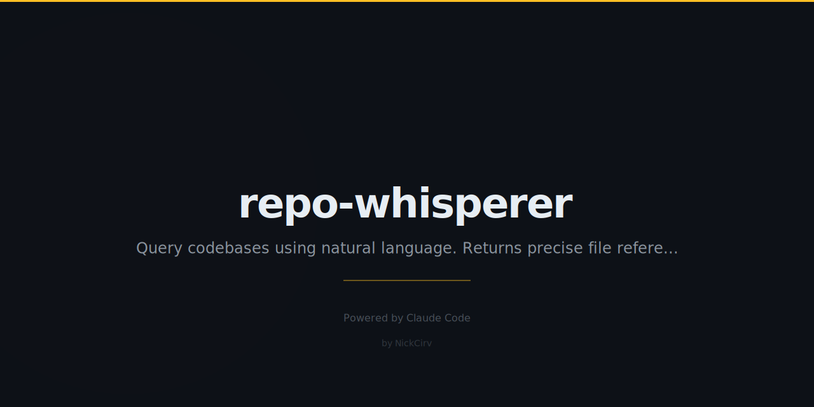

# repo-whisperer

> Talk to any codebase in plain English.

[](https://www.npmjs.com/package/repo-whisperer)
[](LICENSE)
[](https://github.com/NickCirv/repo-whisperer/stargazers)

## The Problem

New repo. 500 files. No docs. The onboarding guide is "read the code." Your senior engineer is "in a meeting." The Slack thread explaining the architecture is from 2021 and half the links are dead. You need answers, not a reading assignment — so you spend 4 hours clicking through files until something clicks.

## Quick Start

```bash
export ANTHROPIC_API_KEY=sk-ant-...

# Explore a local project
npx repo-whisperer ./some-project

# Or pull directly from GitHub
npx repo-whisperer https://github.com/expressjs/express
```

Then just ask questions like you're talking to the person who built it:

```
whisper> How does authentication work?
whisper> Where are the database queries?
whisper> What would break if I deleted src/middleware/auth.js?
whisper> Explain the data flow from API request to database
```

## Example Output

```
$ npx repo-whisperer ./my-api

Scanning my-api...
  Stack: Node.js (Express + TypeScript)
  Files: 47 source, 12 tests
  Entry: src/index.ts

whisper> How does auth work?

Authentication uses JWT tokens with refresh rotation:

1. Login: POST /api/auth/login validates credentials and returns
   an access token (15min TTL) + refresh token (7d TTL)
   src/routes/auth.ts:23-45

2. Middleware: Every protected route passes through authMiddleware
   which validates the JWT and attaches the user to req.user
   src/middleware/auth.ts:8-22

3. Refresh: POST /api/auth/refresh validates the refresh token and
   issues a new pair (old refresh token is immediately revoked)
   src/routes/auth.ts:47-68

whisper> What would break if I deleted src/middleware/auth.js?

Every protected route would lose authentication. 14 route files import
authMiddleware directly:
  src/routes/users.ts, src/routes/posts.ts, src/routes/admin.ts (+11)

The app would start but all /api/* endpoints would be publicly accessible.

whisper>
```

## Features

- **Works on any language** — Node.js, Python, Rust, Go, Ruby, Java, and more
- **GitHub URL support** — clone and explore any public repo instantly
- **File references** — every answer cites the exact file and line number
- **Impact analysis** — ask what breaks if you change or delete something
- **No setup** — no indexing step, no vector DB, no config file needed
- **Conversational** — follow-up questions use context from earlier in the session

## How It Works

1. Scans the repo — file tree, stack detection, entry points, dependencies
2. Builds an auto-summary of the codebase structure
3. For each question, finds the most relevant files via keyword and semantic matching
4. Sends the question + relevant file context to Claude
5. Returns answers with specific file and line references

## Requirements

- Node.js 18+
- `ANTHROPIC_API_KEY` environment variable

**Commands inside the session**

| Command | What It Does |
|---------|-------------|
| Any question | AI answer with file references |
| `tree` | Show project file tree |
| `read <file>` | Display a file's contents |
| `exit` | Quit the session |

## See Also

- [blame-ai](https://github.com/NickCirv/blame-ai) — AI git archaeology, understand WHY any line exists
- [ai-code-roast](https://github.com/NickCirv/ai-code-roast) — Brutal, honest AI code reviews
- [clone-any-app](https://github.com/NickCirv/clone-any-app) — Reverse-engineer and clone any web app

## License

MIT — [NickCirv](https://github.com/NickCirv)
