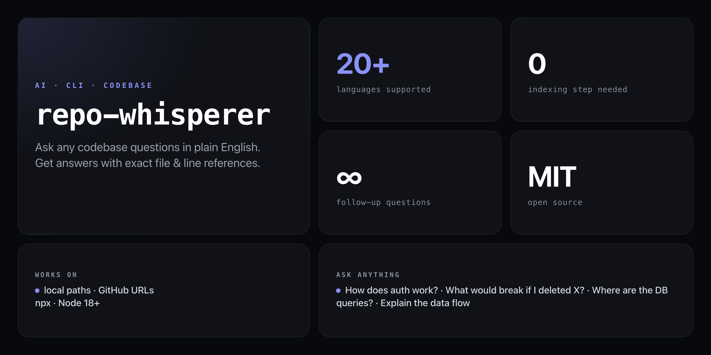

<div align="center">

**Ask any codebase questions in plain English. Get answers with exact file & line references — no indexing, no config.**


</div>

---

New repo. 500 files. No docs. `repo-whisperer` scans the codebase, builds a structural summary, and opens an interactive session where you can ask anything — and every answer cites the exact file and line number.

```
$ npx github:NickCirv/repo-whisperer ./my-api

Scanning my-api...
  Stack: Node.js (Express + TypeScript)
  Files: 47 source, 12 tests
  Entry: src/index.ts

whisper> How does auth work?

Authentication uses JWT tokens with refresh rotation:

1. Login: POST /api/auth/login validates credentials and returns
   an access token (15min TTL) + refresh token (7d TTL)
   📄 src/routes/auth.ts:23-45

2. Middleware: Every protected route passes through authMiddleware
   which validates the JWT and attaches the user to req.user
   📄 src/middleware/auth.ts:8-22

3. Refresh: POST /api/auth/refresh validates the refresh token and
   issues a new pair (old refresh token is immediately revoked)
   📄 src/routes/auth.ts:47-68

whisper> What would break if I deleted src/middleware/auth.js?

Every protected route would lose authentication. 14 route files import
authMiddleware directly:
  src/routes/users.ts, src/routes/posts.ts, src/routes/admin.ts (+11)

The app would start but all /api/* endpoints would be publicly accessible.

whisper>
```

## Install

Requires Node 18+ and an `ANTHROPIC_API_KEY`. No global install needed:

```bash
export ANTHROPIC_API_KEY=sk-ant-...
npx github:NickCirv/repo-whisperer ./your-project
```

Or explore any public GitHub repo directly:

```bash
npx github:NickCirv/repo-whisperer https://github.com/expressjs/express
```

## Usage

```bash
# explore a local directory
npx github:NickCirv/repo-whisperer ./path/to/project

# clone and explore a GitHub repo
npx github:NickCirv/repo-whisperer https://github.com/owner/repo

# use a specific Claude model
npx github:NickCirv/repo-whisperer ./project --model claude-3-5-sonnet-20241022
```

### CLI flags

| Flag | Description |
|------|-------------|
| `[target]` | Local path or GitHub URL (default: current directory) |
| `--model <model>` | Anthropic model to use (default: `claude-3-5-haiku-20241022`) |
| `--version` | Print version |

### Session commands

Once inside a session, type naturally or use these built-in commands:

| Command | What it does |
|---------|-------------|
| Any question | AI answer with file & line references |
| `tree` | Show the project file tree |
| `read <file>` | Display a file's contents |
| `exit` | Quit the session |

## What it detects

repo-whisperer scans for source files across 20+ languages and auto-detects your stack from config files:

| Language group | Extensions |
|----------------|-----------|
| JavaScript / TypeScript | `.js` `.ts` `.jsx` `.tsx` |
| Python | `.py` |
| Systems | `.rs` `.go` `.c` `.cpp` |
| JVM | `.java` `.kt` `.scala` |
| Other | `.rb` `.php` `.swift` `.ex` `.exs` `.clj` `.elm` `.cs` |

Stack detection reads `package.json`, `requirements.txt`, `Cargo.toml`, `go.mod`, `Gemfile`, and more — so it knows whether you're in a React app, an Express API, a Rust binary, or a Go service before you ask your first question.

## How it works

1. Walks the repo (skips `node_modules`, `.git`, `dist`, `build`, etc.)
2. Detects the stack and entry point from config files
3. Builds a structural summary: file counts, key directories, dependencies
4. For each question, selects the most relevant files via keyword matching
5. Sends the question + file context to Claude via the Anthropic API
6. Returns answers with specific `file:line` references

## What it is NOT

- **Not a replacement for reading code.** It guides you to the right files and lines — you still open them. Use `read <file>` inside the session to inspect anything it references.
- **Not a vector database or embedding system.** Context selection is keyword-based and structural, not semantic similarity search. Works well for navigation questions; may miss deeply implicit relationships.
- **Not free to run.** Every question makes an Anthropic API call. Bring your own `ANTHROPIC_API_KEY`.

---

<div align="center">
<sub>Node 18+ · MIT · by <a href="https://github.com/NickCirv">NickCirv</a></sub>
</div>
