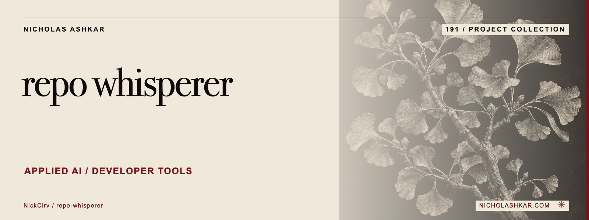

# repo-whisperer

Ask an Anthropic model questions about a selected local or public GitHub codebase.

Builds a lightweight file map, ranks files by question keywords and sends a bounded set of source excerpts through an interactive terminal session.


<a id="install"></a>

## Quickstart

Package runtime requirement: Node.js `>=20`. Git is needed to obtain this pinned source checkout.

```bash
git clone https://github.com/NickCirv/repo-whisperer.git
cd repo-whisperer
git checkout ddf1984157598a31ec34d1a2c95c32c6f04beff5
npm install --ignore-scripts
node bin/whisper.js --help
```

This source-derived example has not been executed in this review. Help is local. Exploring a repository requires `ANTHROPIC_API_KEY`; questions send selected source text to Anthropic.


<a id="cli-flags"></a>

<a id="session-commands"></a>

<a id="what-it-detects"></a>

<a id="how-it-works"></a>

## Usage

```bash
node bin/whisper.js /path/to/project
node bin/whisper.js https://github.com/NickCirv/repo-whisperer
```

GitHub targets are shallow-cloned into a temporary directory. Ask a specific question such as “Where is the request context assembled?” and verify the answer against the files.

[Command reference](docs/REFERENCE.md) covers arguments, modes and output controls.


<a id="what-it-is-not"></a>

## Behavior and limits

Context selection uses up to ten files and the first hundred lines of each selected file, so important behavior may be absent. The scanner has a depth bound. `--model` is advertised but the request builder uses the constant model identifier, so model selection is not wired through at this revision. Model availability and answer quality were not tested. Local code is sent externally when questions are asked.

## Development

Declared package scripts:

| Script | Command |
| --- | --- |
| `start` | `node src/index.js` |
| `dev` | `node --watch src/index.js` |
| `test` | `node --test` |

The smoke test syntax-checks the entrypoint; it does not exercise CLI behavior or integrations.

## Research

[Source review and claim ledger](docs/RESEARCH.md) records revision `ddf198415759`, inspected files and verification gaps.

## License and attribution

Protected license and attribution files remain unchanged: [LICENSE](https://github.com/NickCirv/repo-whisperer/blob/ddf1984157598a31ec34d1a2c95c32c6f04beff5/LICENSE).

[Artwork credits](assets/nicholas-ashkar/CREDITS.md) · [Nicholas Ashkar — consulting](https://nicholashkar.com/#oxblood-contact)
